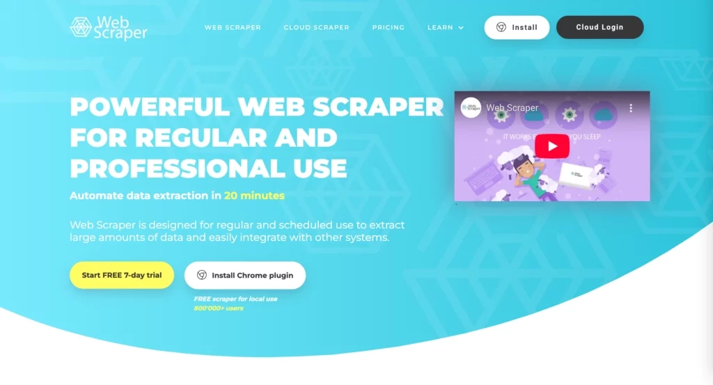

# 10+款最佳网页抓取工具(免费&付费)

---

网页抓取工具就像是你的数据收集小帮手。想想看——大家都在抢数据,这些工具就能直接从网上把信息给你扒拉下来,省了多少事儿。想研究市场趋势?盯着竞争对手的价格?或者就是想看看现在流行啥?抓取工具都能帮你搞定。

接下来我们聊聊那些顶尖的网页抓取工具,它们能干啥、有啥短板,还有一些实用技巧,让你少走弯路。系好安全带,咱们这就开始。

---

## 什么是网页抓取工具?

网页抓取工具就像你的网络小工人。它们在各个网站上穿梭,把你要的信息抓下来,然后整整齐齐地塞进表格或者你喜欢的任何格式里。忘掉那些复制粘贴到眼睛发酸的日子吧,让这些机器人干活,你该干嘛干嘛去。

有些工具超级简单,你只要点点鼠标选择想要的数据就行,基本不用写代码。另外一些高级工具则让你用BeautifulSoup、Selenium或者Crawlee这些编程库完全掌控抓取过程。

不管你选哪种工具,网页抓取器都能帮你收集各种类型的数据——从结构化数据(名字、产品价格、汇率)到文本内容(博客文章、新闻更新、社交媒体评论),再到图片和视频。

## 为什么网页数据抓取这么重要?

互联网基本就是一片信息的海洋——大部分都乱糟糟的,散落得到处都是,而且格式还千奇百怪。如果你想找点有用的东西,手动筛选简直是噩梦,特别是像亚马逊这种网站每隔五秒就更新一次内容。这时候网页抓取就能救你的命了。它直接从几乎任何网站上把你需要的数据扒下来,速度比人快多了。说真的,如果你不想淹死在信息海洋里,这玩意儿就是救生圈。

根据[最近的研究](https://blog.apify.com/state-of-web-scraping/),最常被抓取的数据类型包括产品价格(34.8%)、社交媒体内容(26.1%)、新闻文章(21.7%)和客户评论(13%)。这些信息反映了网页抓取在发现市场趋势、进行市场研究和执行情感分析方面的重要性。这些洞察帮助公司改进营销策略和活动,还能优化产品来留住和吸引客户。

现在,我们来看看精心整理的最佳网页抓取工具清单,涵盖免费和付费方案。

---

### 免费网页抓取工具

#### 1. Goutte

Goutte基本上就是一个开源的PHP工具,让你玩网页爬取和抓取。如果你想从网站上弄数据又不想抓狂,它超级方便。它有个简单的API,能处理填表、点击页面或者从HTML和XML里提取信息这些事儿。如果你用PHP抓网站,八成会碰到Goutte。

**核心功能:**

- Goutte用起来简单,专注于网页抓取的核心功能,没有多余的复杂操作
- 它和Guzzle(一个流行的PHP HTTP客户端)无缝集成,用来处理网络请求和响应。这种组合让Goutte在更复杂的抓取场景下也很灵活
- Goutte的`filter()`方法帮你用CSS选择器在DOM(构成HTML页面的结构化元素树,比如`
`、`<h1>`等)中搜索元素。同时,`filterXPath()`允许基于XPath的选择,`text()`方法则能提取每个元素的内容
- Goutte让网页抓取模拟真实的浏览行为,便于表单提交和链接跟踪

**局限性:**

- Goutte不支持JavaScript。这意味着这个工具没法直接提取通过AJAX请求或客户端脚本动态加载的内容
- 它只在PHP环境下工作良好。如果你不熟悉PHP,用BeautifulSoup或Scrapy代替吧
- Goutte不适合需要高并发或分布式爬取的大规模抓取任务。对于大型项目,你应该选择Scrapy或Puppeteer

**适用场景:**

- 如果你已经在用PHP框架(比如Symfony或Laravel)开发应用,用Goutte就对了
- 非常适合静态网站抓取。因为Goutte不依赖像Selenium或Puppeteer那样的浏览器引擎,所以更快、消耗资源更少

#### 2. Scrapy

Scrapy是一个用Python写的开源网页抓取框架。它是个完整的工具包,帮你构建网页爬虫,还能处理一些复杂任务,比如管理请求队列、管理cookies和用户代理、处理代理和中间件。这让开发者能专注于写抓取逻辑,而不是从头开始构建一切。

**核心功能:**

- Scrapy使用**爬虫**(spiders)来爬取网站并在很少监督的情况下提取数据。爬虫包含跟踪链接和解析网页内容的规则。Scrapy可以同时运行多个爬虫,甚至能跨分布式系统扩展
- Scrapy采用**异步网络**同时发送多个请求,而不是一个接一个地发送。这帮助它更快地爬取成千上万的页面
- 这个工具使用**内置中间件**来处理速率限制、cookies、用户代理或重试这些事情
- Scrapy采用模块化架构,允许你集成自定义管道、中间件或第三方库。这种灵活性帮你在细粒度级别控制抓取过程

**局限性:**

- Scrapy不解释JavaScript。所以对于JavaScript重度网站,你需要把Scrapy和其他工具(比如Splash,一个无头浏览器)结合,或者直接用Selenium和Playwright
- Scrapy学习曲线陡峭。这意味着你必须理解Python、网页抓取原理和异步编程才能有效使用这个工具

**适用场景:**

- 如果你想要一个可扩展且高效的工具用Python提取大量数据,用Scrapy。但如果你更喜欢初学者友好的工具或者从基于JavaScript的网站提取数据,就别用它

#### 3. Playwright

Playwright是微软开发的强大浏览器自动化和测试框架。这个库能帮你打开网页、点击按钮、输入文本、提取数据、截图,甚至同时处理多个页面。它支持多种编程语言,比如Python、JavaScript(配合Node.js)、Java和.NET(C#)。

**核心功能:**

- Playwright允许你以编程方式控制真实浏览器(比如Firefox、Chromium或WebKit)
- 这个网页抓取工具可以从加载JavaScript内容的动态网站中提取数据
- Playwright能同时自动化多个浏览器标签/页面
- 它有时能绕过简单的验证码
- 这个库便于配置代理来规避反抓取措施
- Playwright让你能阻止、调整或管理HTTP请求/响应(比如跳过图片或更改请求头)

**局限性:**

- Playwright驱动真实浏览器,所以比轻量级抓取器(比如Scrapy或Goutte)消耗更多CPU/内存
- 这个库比初学者友好的工具(比如BeautifulSoup)更复杂,特别是在处理异步代码时

**适用场景:**

- 如果你想抓取JavaScript重度网站或用同一代码库进行跨浏览器测试,Playwright很理想
- 这个库最适合自动化真实浏览器交互,比如登录、表单提交或点击
- 如果你需要从静态HTML页面提取或者进行超大规模抓取,别用Playwright,因为它的浏览器开销相比异步HTTP抓取器可能很昂贵

#### 4. WebScraper.io

WebScraper.io基本上适合所有人,不管你是完全的新手还是真的懂代码。它就是个Chrome扩展,你装到浏览器上就能开始了。现在,它有Scrapy那么硬核吗?不太行,但如果你不是想下载半个互联网或者搞什么疯狂的自动化设置,它能完成任务。

**核心功能:**

- 用WebScraper时你不需要懂一行代码。只要点击你想抓的东西,然后它就搞定剩下的
- 这个工具让你构建站点地图,告诉它要访问哪些页面、要获取什么信息
- 它轻松处理使用JavaScript或AJAX的现代网站
- 用WebScraper导出数据很简单——直接从浏览器提取到CSV,或者用它的云服务,然后以CSV、Excel、JSON等任何格式获取数据。而且你甚至可以把它连接到Dropbox、S3、Google Sheets、API和webhooks
- 它会替你自动运行。用WebScraper,你可以根据时间表自动运行抓取,并使用IP轮换来避免被封

**局限性:**

- WebScraper只在Google Chrome上工作,不提供跨浏览器支持
- 它的免费计划对抓取量有限制。对于大规模或基于云的抓取项目,你需要升级到付费计划

**适用场景:**

- 如果你是初学者,需要一种快速、无代码的方式直接从浏览器提取网页数据,WebScraper.io很理想。但如果你想要高级功能或大规模抓取,你需要转向付费计划或更强大的工具

---

### 免费增值和试用网页抓取工具

#### 5. Octoparse

Octoparse是一个无代码网页抓取解决方案。它提供广泛的工具来简化你的抓取过程,同时仍然让你完全控制抓取任务。

**核心功能:**

- Octoparse让网页抓取变得不那么痛苦——即使你完全是新手。通过智能模式和向导模式,你基本上就是点点鼠标,选择你想要的,砰的一声,它就给你设置好了一切。甚至还有即插即用的模板,比如那个Twitter抓取模板,所以你不用每次都重新发明轮子
- Octoparse将AI直接集成到它的抓取功能中。像自动检测这样的功能可以自动识别网页上的模式(比如产品项、列表或评论),并为你提供实时提示。这帮助即使是初学者也能更快入门并避免犯错
- 这个工具通过自动化帮你管理整个过程。特别是,你可以安排抓取器在特定时间自动运行,或者在云中24/7运行而不用保持电脑开机。这些抓取器还能自动导出数据,并通过OpenAI集成与其他工具连接
- Octoparse配备了IP轮换、代理支持,甚至验证码破解。所以你花更少时间被封,花更多时间实际收集你来要的数据
- 👉 [想轻松绕过复杂的反爬机制?试试这个覆盖全球的专业抓取方案](https://www.scraperapi.com/?fp_ref=coupons)
- 这个工具支持XPath来帮你高精度地提取特定元素

**局限性:**

- 使用像XPath这样的高级功能需要初学者有先验知识

**价格(按月计费):**

- 免费,最多10个任务(保存的网页抓取工作流)
- 标准版:从每月$69起,100个任务
- 专业版:从每月$249起,250个任务
- 企业版(联系销售)750+个任务

注意:所有付费计划都有7天免费试用。

#### 6. ParseHub

ParseHub是一个网页抓取工具,提供基于点击的界面来帮助初学者在不懂编码的情况下提取网页数据。此外,它通过自动化功能支持更高级的抓取需求。

**核心功能:**

- 你可以从任何网站获取数据,甚至是JavaScript和AJAX页面。此外,你可以轻松引导ParseHub做复杂的部分,比如通过表单搜索、打开下拉菜单、点击地图、登录网站,以及处理无限滚动、标签或弹窗来提取数据
- ParseHub带有机器学习关系引擎来扫描网页,理解元素的层次结构,并以Excel和JSON格式提取数据。这消除了从头编码的需要
- 这个工具有正则表达式在下载数据之前清理文本和HTML。它还允许你安排抓取器自动运行,并在抓取有严格控制的网站时使用IP轮换来避免检测和封锁

**局限性:**

- 抓取器在你的设备上运行,所以扩展需要更多硬件
- 与自己编码抓取器或使用专用抓取API相比,深度定制或企业级扩展受限

**价格:**

- 免费,每次运行200页
- 标准版:每月$189,每次运行10K页
- 专业版:每月$599,每次运行无限页
- ParseHub Plus(联系销售)

#### 7. Apify

Apify是一个全栈网页抓取和自动化平台,允许你检索、转换和自动化从网站提取数据,无需安装自己的基础设施。通过Apify,你可以大规模构建、运行和共享网页抓取器或自动化任务(称为Actors)。

**核心功能:**

- Apify提供6000个预构建的Actors来抓取网站、自动化网络并为AI提供网页数据。Apify市场上的一些典型Actors包括Instagram抓取器、Google Maps抓取器和网站内容爬虫。除了这些预构建模板,你可以使用JavaScript、Python和TypeScript构建自己的,或者让专家代表你构建和维护自定义网页抓取解决方案
- 你可以以各种格式导出抓取的数据,比如CSV、Excel或JSON,或者直接导出到数据库和API。然后数据被放入Google Sheets、Zapier、Make和其他集成中
- Apify可以模拟人类浏览(比如点击、滚动、登录或与表单交互)。这种能力使它对过程自动化很有用,比如填写表单、跟踪网站或运行机器人
- 它通过Apify Proxy提供自动IP轮换。此外,它的反封锁工具帮助绕过速率限制、验证码和反抓取措施
- 你可以按计划自动运行抓取器,并构建一个actor馈送到另一个actor的工作流

**局限性:**

- 它的性能取决于代理网络和目标站点
- Apify最适合批量抓取,但不适合实时流数据(比如监控变化的股票价格)

**价格:**

- 免费
- 入门版:每月$39
- 规模版:每月$199
- 商业版:每月$999
- 定制版(联系销售)

#### 8. ZenRows

ZenRows是一个基于云的网页抓取API和自动化工具。它简化了网页数据检索,并消除了常见挑战,比如代理管理、JavaScript渲染和反机器人检测。

**核心功能:**

- ZenRows带有通用抓取器API来处理JavaScript渲染、IP轮换、浏览器指纹识别和反机器人检测。此外,它提供针对特定行业定制的预配置API端点,比如电子商务、房地产或搜索引擎
- 它通过单个连接URL与现有的Playwright或Puppeteer工作流无缝集成。此外,它允许你访问全球住宅代理网络(跨190+个国家的5500万+个IP)
- ZenRows有一个对开发者友好的仪表板,带有用于会话控制、渲染等待选项、自定义标头、JSON输出和结构化数据解析的干净API

**局限性:**

- ZenRows不支持深度定制。所以如果你想对代理、脚本工作流或复杂登录流程进行细粒度控制,ZenRows不是个好选择
- 它的自动解析功能很强大,但仅限于支持的网站。如果站点结构发生变化,解析会失败并需要手动干预
- ZenRows对非开发者来说学习曲线陡峭

**价格:**

- 免费
- 开发者版:每月$69
- 创业版:每月$129
- 商业版:每月$299
- 企业版(联系销售)

---

### 仅付费网页抓取工具

#### 9. Bright Data

Bright Data(前身为Luminati Networks)是世界领先的代理服务、网页数据提取和自动化抓取平台之一。它使你的业务能够以大规模、合规和道德的方式抓取网站。

**核心功能:**

- Bright Data提供超过1.5亿个IP地址的多样化代理网络,涵盖住宅、数据中心、ISP和移动代理。它还支持邮政编码或城市级别的地理定位
- Bright Data有高正常运行时间(约99.99%)和强大的成功率(住宅代理为99.95%)。它的响应时间也很快,住宅代理约0.7秒,数据中心代理约0.24秒
- 该平台通过高级工具自动化复杂的抓取任务并绕过限制,比如Web Scraper API、Web Unlocker API等。它还带有Proxy Manager应用、全面的REST API和浏览器扩展来以编程方式监控代理
- Bright Data的市场提供预构建或自定义数据集,以及在其云中直接创建抓取器的Web Scraper IDE

**局限性:**

- Bright Data对初学者来说可能很复杂
- 该平台不适合基础或轻量级抓取任务

#### 10. ScrapingBee

ScrapingBee是一个网页抓取API,处理常见挑战来帮你从你喜欢的网站提取重要的网页数据。你可以通过简单的API调用与它交互,并获得结构化数据或内容作为回报。

**核心功能:**

- ScrapingBee通过最新的Chrome版本管理数千个无头实例
- 它渲染JavaScript来抓取任何网页,甚至使用React、AngularJS、Vue.js和其他库的单页应用。你可以构建自定义抓取请求或脚本来处理复杂的JavaScript情况并定制抓取过程
- 该平台自动轮换住宅/数据中心代理,并带有反机器人措施(比如验证码解决)来减少封锁并绕过像Cloudflare这样的严格保护
- ScrapingBee使用AI根据你的描述识别相关内容并以结构化数据格式返回
- 它为Python和Node.js提供丰富的API和SDK支持。此外,它支持HTTPS加密、IP白名单、使用监控,以及带有日志记录和测试控制台的仪表板

**局限性:**

- 对于复杂任务(比如爬取Amazon的分页),你可能会发现ScrapingBee限制性强且文档不足
- ScrapingBee纯粹基于API,这让初学者觉得困难
- 一些用户报告直接通过ScrapingBee提取PDF内容时有困难

**价格:**

- 自由职业者:每月$49(25万API积分)
- 创业版:每月$99(100万API积分)
- 商业版:每月$249(300万API积分)
- 商业+版:每月$599(800万API积分)

#### 11. Mozenda

Mozenda是一个专为企业设计的基于云的网页抓取工具。它从网站提取大量数据,无需从头构建自定义抓取器。Mozenda是自助服务的,这意味着企业可以使用Mozenda的工具自己执行抓取任务。

**核心功能:**

- Mozenda处理大规模抓取任务,如果你的企业想在自己的基础设施内运行,它支持本地托管
- 它提供无代码界面,允许非技术用户设置抓取器,然后点击他们想提取的数据
- 这个工具以各种格式(CSV、Excel、XML和数据库)导出数据,并与其他服务集成
- 它通过电话和电子邮件提供强大的客户支持

**局限性:**

- 价格高,因为Mozenda面向大型企业

**价格:**从每月$250起,有14天免费试用

#### 12. ScraperAPI

ScraperAPI帮助开发者构建网页抓取器,而无需担心代理、验证码和浏览器自动化的技术复杂性。它通过简单的API调用从任何网站提取原始HTML。这使抓取更快、更顺畅、更少出错。

**核心功能:**

- ScraperAPI有庞大的代理池,以及针对具有挑战性用例(比如电子商务、社交媒体或搜索引擎)的特殊代理。此外,它的智能IP轮换系统只在需要时切换代理,从而最小化代理成本
- 它带有智能路由逻辑,将请求分散到多个网络(子网)以避免检测和封锁
- 这个工具使用自动节流来防止验证码和网站过载
- ScraperAPI可以绕过高级反机器人系统(比如PerimeterX或DataDome),这些系统会封锁许多抓取器
- 这个工具使用DataPipeline(用于计划的定期抓取)和Async Scraper(用于大批量)来大规模处理请求
- 它返回干净的结构化数据。这节省了清理和解析的时间

**局限性:**

- 与其他竞争对手相比,ScraperAPI的结构化数据端点较少。所以在某些用例中你需要自己额外解析

**价格:**以下所有付费计划都有7天免费试用

- 爱好版:每月$49,10万API积分
- 创业版:每月$149,100万API积分
- 商业版:每月$299,300万API积分
- 扩展版:每月$475,500万API积分
- 企业版(联系销售)

#### 13. Import.io

Import.io是一个基于云的网页数据提取工具,帮你从网站(特别是电子商务网站)收集结构化数据,无需编写代码。它支持可扩展抓取,允许你同时从数千个站点检索数据。

**核心功能:**

- Import.io有一个点击界面,用户可以可视化地选择数据。它还带有AI来提取你想要的内容并最小化手动配置
- 该平台针对特定行业定制,比如零售、电子商务、旅游或票务。它还为更复杂的抓取任务提供托管服务和专家支持
- 你可以安排抓取器定期运行并捕获定期变化的数据
- 它支持不同格式的数据输出,并与各种分析服务(比如Tableau)集成

**局限性:**

- 高成本
- Import.io在处理复杂任务(比如无限滚动、AJAX重度站点、下拉导航或复杂逻辑工作流)时表现不佳

**价格:**从每月$199起

---

## 如何选择合适的网页抓取工具?

选择合适的网页抓取器取决于许多因素,包括你的目的、技术技能、预算限制和你想抓取的网站类型。以下是如果你想选择最好的工具该怎么做。

### 1. 确定你的需求

如果你的目标是基础的、一次性的或小规模抓取,选择简单的点击式抓取器,比如ParseHub或Octoparse。但如果你的抓取项目是长期和大规模的,选择可扩展的工具,比如Apify、ScraperAPI或
